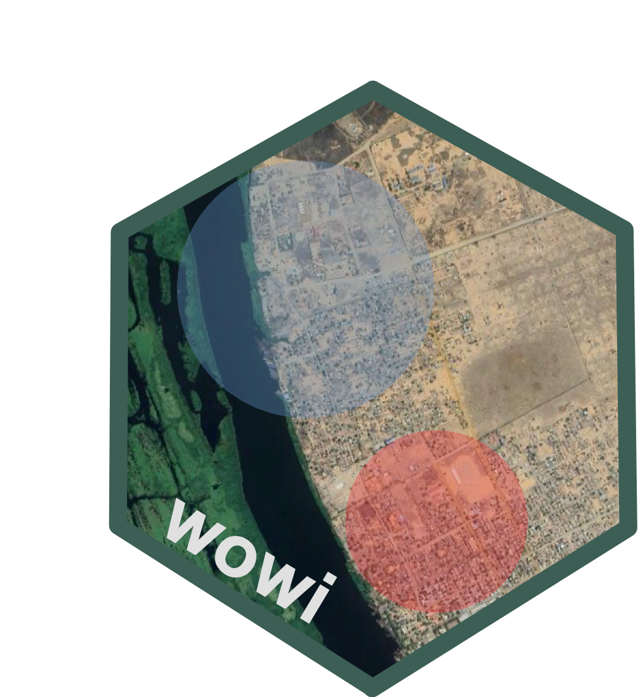

<!-- README.md is generated from README.Rmd. Please edit that file -->

# wowi: Utilities for detecting statistically significant spatial clusters of high acute malnutrition rates using SaTScan’s Bernoulli spatial-scan model <a href="https://nutspatial.github.io/wowi/"></a>

<!-- badges: start -->  
[](https://www.repostatus.org/#wip)
[](https://lifecycle.r-lib.org/articles/stages.html#experimental)
[](https://github.com/nutspatial/wowi/actions/workflows/R-CMD-check.yaml)
[](https://app.codecov.io/gh/nutspatial/wowi)  
<!-- badges: end -->

Child acute malnutrition can lead to death if not identified and treated
in time. Driven by a combination of diverse factors, it often exhibits
spatial variation. The levels of acute malnutrition are commonly
measured through surveys that are representative of the area of
interest. These survey results are then used to inform programme
responses — to find and treat affected children. To that end, programme
managers require actionable insights on where acute malnutrition is most
prevalent. This is essential for prioritising interventions, especially
when resources are limited.

`wowi` - an expression meaning *“where”* in Elómwè, a local language
spoken in central-northern Mozambique - provides convenient utilities
for this purpose. It identifies locations across the survey area where
acute malnutrition is significantly high (hotspots) or low (coldspots),
and unlikely to be due to chance alone.

`wowi` is a wrapper package built on top of the
[`rsatscan`](https://cran.r-project.org/web/packages/rsatscan/index.html)
package, which enables the use of the
[`SaTScan`](https://www.satscan.org) software from within R. While
`rsatscan` provides general-purpose functionality, wowi was specifically
made for acute malnutrition analysis, tailoring the tools to the needs
of nutrition-focused spatial investigations.

To use `wowi`, you must have SaTScan installed on your machine, along
with the [`mwana`](https://nutriverse.io/mwana/dev/) R package for
preprocessing anthropometric data.

## Installation

`wowi` is not yet on CRAN but can be installed through:

``` r
pak::pak(pkg = "nutspatial/wowi")
```

## What does `wowi` do?

It takes a dataset with GPS coordinates (latitude and longitude), scans
for clusters of acute malnutrition — either high or low, depending on
the user’s specification — across the survey area, and returns three
main outputs: (1) an interactive HTML map displaying the detected
clusters (previewed below); (2) a .txt file containing the results; and
(3) a table with summary statistics and metadata parsed from the .txt
file.

This package is particularly handy when working with datasets that span
multiple areas or administrative units, enabling consistent, area-wise
detection of hotspots and coldspots. It also generates additional
GIS-based files (e.g., shapefiles), which can be useful for further
geospatial manipulation or integration into other mapping workflows.

### A glimpse of detected hotspots and coldspots


### A glimpse of the summary table

``` r
## # A tibble: 2 × 18
##  survey_area nr_EAs total_children total_cases `%_cases` location_ids   geo   radius span  children n_cases expected_cases observedExpected relative_risk
##  <chr>        <int>          <int>       <int>     <dbl> <chr>          <chr> <chr>  <chr>    <int>   <int>          <dbl>            <dbl>         <dbl>
## 1 District        36            532         104        19 23,24,26,25,3… 13.6… 1.43 … 1.88…      170       4           33.2             0.12         0.085
## 2 District        36            532         104        19 16,20,14,12,1… 13.8… 26.24… 43.5…      258      84           50.4             1.67         4.46
## # ℹ 4 more variables: `%_cases_in_area` <dbl>, log_lik_ratio <dbl>, pvalue <dbl>, ipc_amn <chr>
```

### Shiny App

To use the included Shiny App, run the following function in R:

``` r
ww_run_app()
```

This will initiate the app through the web browser installed on your
machine.

## Citation

If you use `wowi` package in your work, please cite using the suggested
citation provided by a call to `citation()` function as follows:

``` r
citation("wowi")
#> To cite wowi in publications use:
#> 
#>   Tomás Zaba (2025). _wowi: Utilities for detecting statistically
#>   significant spatial clusters of high acute malnutrition rates using
#>   SaTScan's Bernoulli spatial-scan model_. R package version 1.0.0,
#>   <https://nutspatial.github.io/wowi/>.
#> 
#> A BibTeX entry for LaTeX users is
#> 
#>   @Manual{,
#>     title = {wowi: Utilities for detecting statistically significant spatial clusters of high acute malnutrition rates using SaTScan's Bernoulli spatial-scan model},
#>     author = {{Tomás Zaba}},
#>     year = {2025},
#>     note = {R package version 1.0.0},
#>     url = {https://nutspatial.github.io/wowi/},
#>   }
```

## Community guidelines

Feedback, bug reports and feature requests are welcome; file issues or
seek support [here](https://github.com/nutspatial/wowi/issues). If you
would like to contribute to the package, please see the [contributing
guidelines](https://nutspatial.github.io/wowi/CONTRIBUTING.html).
